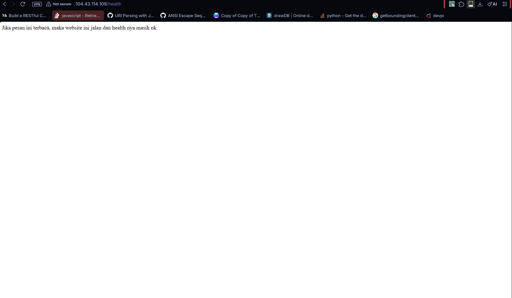
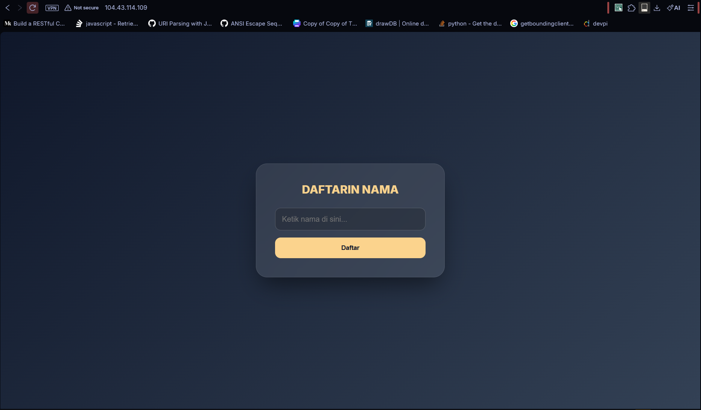
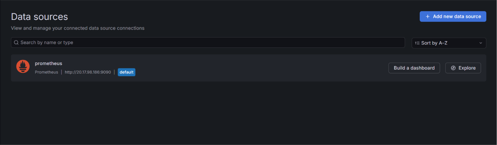
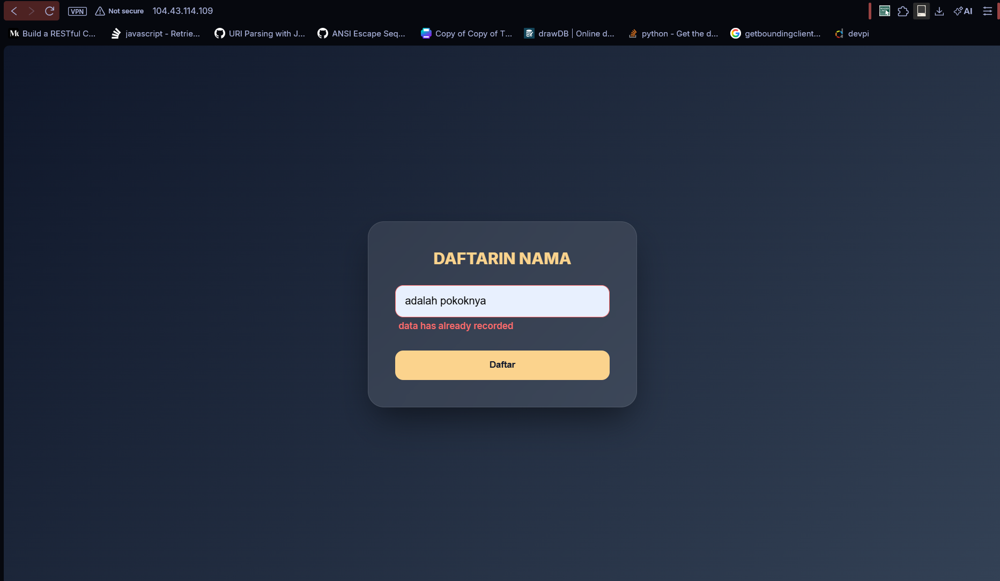

# Tugas 1 Open Recruitment NCC (DOCKER)
---

## Deskripsi singkat
Service yang saya buat adalah sebuah aplikasi yang mendaftarkan nama ke sistem lalu akan meredirect ke halaman kedua yang isinya menyapa nama yang didaftarkan.


## Endpoint health
Endpoint health atau yang menjadi inti dari tugas ini akan mengembalikan "Jika pesan ini terbaca, maka website ini jalan dan health nya masih ok" sesuai contoh/permisalannya. Endpoint health ini nantinya juga akan digunakan sebagai HEALTHCHECK untuk menentukan apakah container yang dijalankan masih berfungsi ataukah tidak.

## Screenshot

endpoint health





## Proses build docker
Konfigurasi docker dilakukan dengan membuat file Dockerfile di setiap folder FE dan BE. Dockerfile tersebut adalah sebuahfile dimana kita meberikan perintah-perintah untuk docker mulai dari install dependensi, install modul, salin direktori, hingga run file utama dan melakukan healthcheck.
sebagai contoh ini untuk backend
```dockerfile
FROM python:3.13.3-slim

ENV BE_addr="http://localhost:10001"

WORKDIR /main-app

COPY . . 

RUN pip install -r requirements.txt

EXPOSE 5000

CMD ["python", "webserver.py"]


HEALTHCHECK --interval=30s --timeout=30s --start-period=5s --retries=3 CMD [ "curl", "-f", "localhost:5000/health" ] || exit 1
```
disini pertama kita inisialisasi dulu paaki base image apa, lalu juga ditambahkan sebuah environment yang mengarah ke URL Back End. Selanjutnya kita ganti workdir kita ke folder main-app tempat semua file dan kebutuhan kita berada, dan copy semua file dari host computer kita ke tempat tersebut. Jangan lupa jalankan install modul-modul python yang dibutuhkan dari file requirements.txt. Lalu, kita expose 5000 untuk menyatakan bahwa container ini memiliki port terbuka di 5000. Untuk menjalankannya sendiri, gunakan CMD python webserver.py seperti run python pada umumnya. untuk healthcheck, kita lakukan dengan interval 30s dengan waktu tunggu 30s juga untuk memastikan apakah aplikasi kita masih jalan atau tidak. bagian BE juga mirip dengan ini


lalu, kita gunakan docker compose.yml untuk orksetrasi backend dan frontend
```yaml
services:
  frontend:
    # image: python:3.13.3-slim
    build: ./FE
    ports:
      - "80:5000"

  backend:
    # image: python:3.13.3-slim
    build: ./BE
    ports:
      - "10001:5000"
```
dengan compose.yml ini kita bisa mengarahkan docker untuk nge-build setiap direktori kita dan melakukan exposing port, untuk backendkita arahkan port 80 host ke port 5000 container juga backend dari 10001 ke 5000.


## Deployment ke VPS
Untuk melakukan deployment ke VPS, kita akan menggunakan azure student. kita konfigurasikan azure dengan konfigurasi termurah dengan menerapkan discount nya azzure yang membuat harga menjadi sekitar $0.02 per jamnya. Kita juga expose port-port yang diperlukan dengan list:
- 22 ssh
- 80 HTTP (FE)
- 443 HTTPS
- 10001 HTTP (BE)
setelah itu, jangan lupa kita untuk konfigurasi username and password VPS untuk login ssh nantinya.

setelah semua starting server selesai, jalankan VPS menggunakan tombolnya
lalu bisa kita sambungkan ssh kita melalui terminal ke VPS dengan `ssh user@password`

copy semua file dari lokal ke VPS menggunakan FileZilla atau sftp cllient lainnya
setelah itu, konfigurasikan docker agar bisa jalan.

pergi ke folder tempat kita copy semua. 
gunakan docker compose up --build untuk build dan run service kita.

