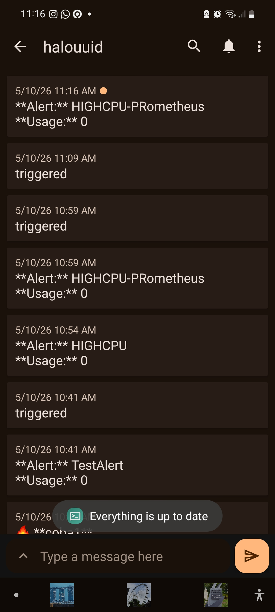

## Deskripsi arsitektur sistem monitoring (Prometheus, Grafana, dan target)

Arsitektur yang saya buat ini terdiri dari 2 server VM yang menggunakan layanan Azure dengan Student Subscription VM 
Standard D2as dengan spesifikasi server yang sama:
- 2 vCPU 
- 2 Threads per core
- 8 GB RAM
- menjalankan ubuntu-24_04-lts

masing-masing dari server tersebut akan menjalankan Prometheus+Node_exporter dan Grafana. Untuk loadnya sendiri, saya menggunakan aplikasi docker dari tugas pertama dan akan melakukan stress test tambahan untuk melihat perubahan performa pada grafana ketika menjalankan load yang berat. Stress test akan dilakukan menggunakan package `stress` yang dijalankan di VM yang sama dengan VM Prometheus.

## Penjelasan integrasi Prometheus dengan Grafana
prometheus dan grafana bekerja di server yang berbeda, sehingga salah satu cara dan mungkin satu-satunya cara untuk membuat mereka berkomunikasi adalah melalui internet connection. Untuk itu, kita buka sebuah port di sisi prometheus melalui port `9090` yang menjadi gerbang masuk grafana ketika ingin mengambil data dari prometheus yang juga mengembil data dari node_exporter. Grafana akan mengambil data dari prometheus secara fixed interval sesuai dengan konfigurasi grafana, begitu juga prometheus yang akan mengambil data dari exporternya sesuai dengan interval yang sudah dikonfigurasikan.

## Screenshot konfigurasi Prometheus
Di prometheus sendiri, karena saya tidak menggunakan banyak service, saya menggunakan konfigurasi dari github pertemuan 3 kemarin saja:
```yaml
global:
  scrape_interval: 15s
  evaluation_interval: 15s

rule_files:

scrape_configs:
  - job_name: "prometheus"
    static_configs:
      - targets: ["localhost:9090"]

  - job_name: "node"
    static_configs:
      - targets: ["localhost:9100"]
```
konfigurasi ini akan melakukan scraping dari prometheus itu sendiri dan dari hardware device tempat node_exporter bekerja. Kedua job ini akan melakukan scraping satu kali setiap 15 detik.


## Screenshot konfigurasi data source di Grafana

Di grafana sendiri, kita menggunakan 1 data source yaitu prometheus. Untuk itu, kita konfigurasikan grafana yang mengambil data langsung dari prometheus melalui interfacenya prometheus di `ip_prome:9090`.


## Screenshot custom dashboard


Custom dashboard yang saya buat di sini menunjukkan data-data yang menurut saya penting untuk ditunjukkan dalam mengetahui performa sebuah server. Saya di sini menunjukkan beberapa hal:
- non-idle CPU load % dengan PromQL \
`100 - (avg(irate(node_cpu_seconds_total{mode="idle"}[5m])) * 100)` \
untuk menunjukkan berapa overall CPU % yang digunakan oleh keseluruhan komputer
- total uptime dengan PromQL 
`time() - node_boot_time_seconds{instance="localhost:9100"}` 
untuk menunjukkan sudah berapa lama server berjalan. Metric ini juga bisa digunakan untukmelihat apakah server pernah mati?
- Memory used \
`avg(100 * (1 - (node_memory_MemFree_bytes + node_memory_Buffers_bytes + node_memory_Cached_bytes) / node_memory_MemTotal_bytes))`
- Disk IO usage \
` avg by(device) (node_disk_io_now)`\
melihat apakah terdapat IO disk yang tengah digunakan (apakah sistem melakukan i/o reading dan seberapa berat atau hanya melakukan komputasi saja)
- Network in/out \
`avg(node_network_receive_bytes_total)` \
karena kita memonitor sebuah webserver, maka pastinya network adalah salah satu hal utama yang harus dicek. 

## Penjelasan alur monitoring (metrics → Prometheus → Grafana → alert)

Monitoring dimulai dari sebuah node_exporter yang melakukan scraping sistem yang dimonitor ketika prometheus menembak `/metrics` pada webserver ringan node_exporter. hasil scraping dari node_exporter tersebut akan mengirimkan hasil scraping ke prometheus dan disimpan oleh prometheus. Di sisi lain, grafana akan melakukan hal yang mirip dengan prometheus ke node_exporter. Grafana akan menembak ip prometheus untuk mendapatkan data terbaru setiap interval waktu yang sudah ditentukan di grafana. Lalu, dengan hasil tersebut, Grafana akan mengquery dan mengolah hasil tersebut agar menjadi sebuah visualisasi data yang mudah dicerna oleh manusia. Setelah data diterima oleh Grafana, grafana bisa melakukan komputasi dan proses tambahan terhadap data tersebut, salah satunya adalah proses alerting. Proses alerting ini berfungsi untuk memberikan notifikasi kepada penjaga sistem agar tahu jika sistem mengalami anomali melalui notifikasi sesuai pilihannya (email, discord, etc.). Saya disini menggunakan webhook dengan tujuan ke sebuah service pub/sub notification system bernama ntfy.sh . Dengan service ini, ketika sistem mengalami anomali, grafana akan mengirim data ke service tersebut, dan semua devices yang subscribe ke channel nya, akan mendapat notif:


## Kendala yang dihadapi (jika ada)